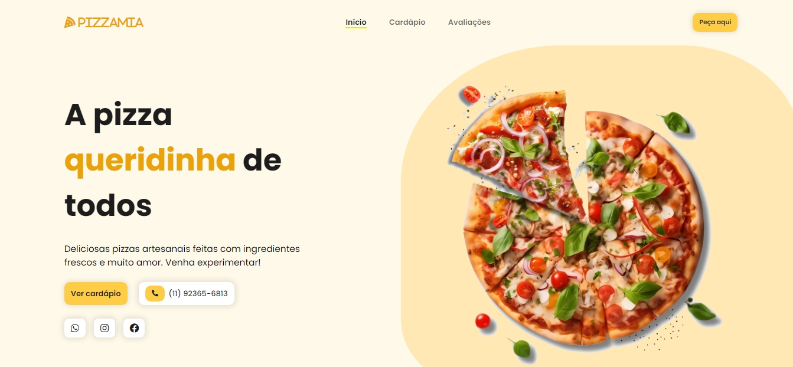

  

<h1>🍕Pizzamia</h1>

 
  Landing page responsiva de pizzaria, aplicando conhecimentos adquiridos em HTML, CSS e Javascript. A Landing page possui as seções de homepage, cardápio e avaliações. Foi utilizado jQuery e a biblioteca Scroll Reveal para adicionar animações de rolagem à página, tornando-a mais dinâmica.

 

<h2>💻Tecnologias e ferramentas utilizadas</h2>

   
   
     
  
          

 

📆 Atualizado em julho, 2024.
 